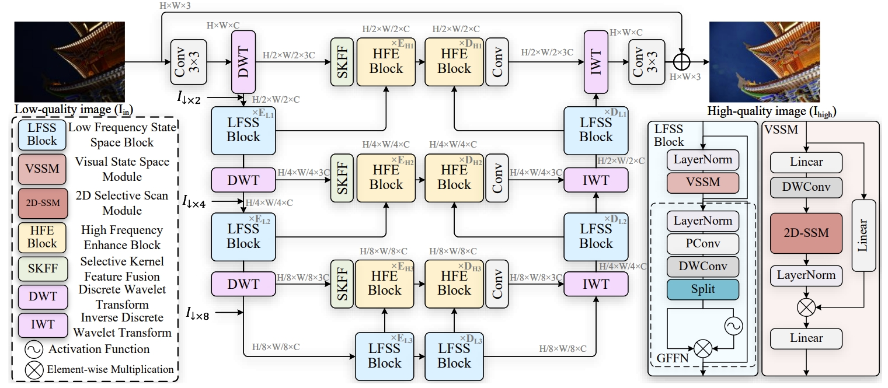
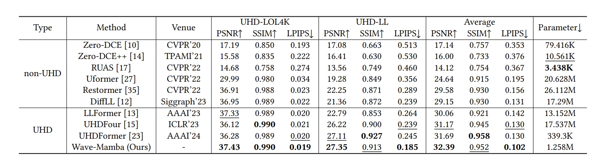
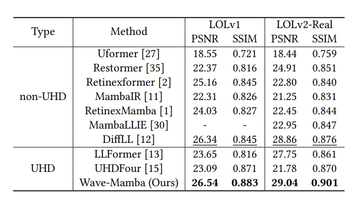
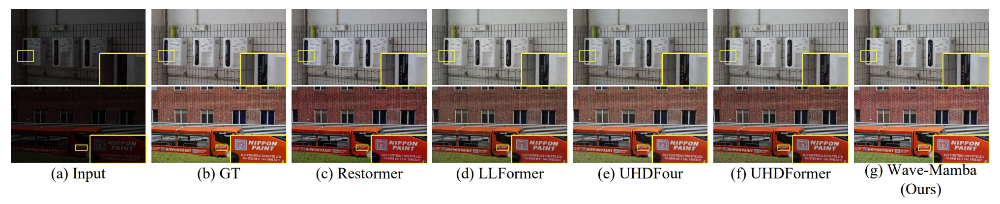
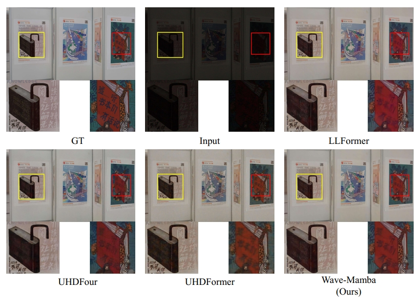
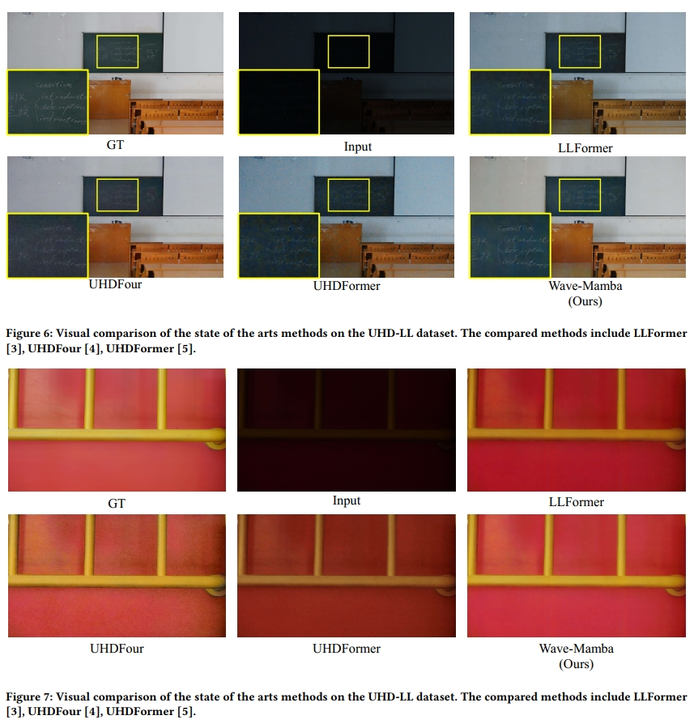

# Wave-Mamba: Wavelet State Space Model for Ultra-High-Definition Low-Light Image Enhancement (ACMMM2024)


This is the office implementation of ***Wave-Mamba: Wavelet State Space Model for Ultra-High-Definition Low-Light Image Enhancement, ACMMM2024.***

<a href="https://alexzou14.github.io">Wenbin Zou*,</a> Hongxia Gao <sup>✉️</sup>, Weipeng Yang, and Tongtong Liu
<br>
[](https://arxiv.org/pdf/2408.01276)
[](https://openreview.net/forum?id=oQahsz6vWe&referrer=%5BAuthor%20Console%5D(%2Fgroup%3Fid%3Dacmmm.org%2FACMMM%2F2024%2FConference%2FAuthors%23your-submissions))

<hr />



> **Abstract:** *Ultra-high-definition (UHD) technology has attracted widespread attention due to its exceptional visual quality, but it also poses new challenges for low-light image enhancement (LLIE) techniques. UHD images inherently possess high computational complexity, leading existing UHD LLIE methods to employ high-magnification downsampling to reduce computational costs, which in turn results in information loss. The wavelet transform not only allows downsampling without loss of information, but also separates the image content from the noise. It enables state space models (SSMs) to avoid being affected by noise when modeling long sequences, thus making full use of the long-sequence modeling capability of SSMs. On this basis, we propose Wave-Mamba, a novel approach based on two pivotal insights derived from the wavelet domain: 1) most of the content information of an image exists in the low-frequency component, less in the high-frequency component. 2) The high-frequency component exerts a minimal influence on the outcomes of low-light enhancement. Specifically, to efficiently model global content information on UHD images, we proposed a low-frequency state space block (LFSSBlock) by improving SSMs to focus on restoring the information of low-frequency sub-bands. Moreover, we propose a high-frequency enhance block (HFEBlock) for high-frequency sub-band information, which uses the enhanced low-frequency information to correct the high-frequency information and effectively restore the correct high-frequency details. Through comprehensive evaluation, our method has demonstrated superior performance, significantly outshining current leading techniques while maintaining a more streamlined architecture.* 
<hr />

## TODO List
- [x] Testing Code&Checkpoint
- [x] Model.py
- [x] Train.py

## Dependencies and Installation

- Ubuntu >= 22.04
- CUDA >= 11.8
- Pytorch>=2.0.1
- Other required packages in `requirements.txt`
```
cd WaveMamba 

# create new anaconda env
conda create -n wavemamba python=3.8
conda activate wavemamba 

# install python dependencies
pip3 install -r requirements.txt
python setup.py develop
```

## Datasets Download

[UHD-LL](https://li-chongyi.github.io/UHDFour/), [UHDLOL4K](https://taowangzj.github.io/projects/LLFormer), [LOL](https://daooshee.github.io/BMVC2018website/)

## Pre-trained Model

[LOL, UHDLL, UHDLOL4K] (https://drive.google.com/drive/folders/1ifB1g7fRCPqPTKyq366lzd_zDkA2j297?usp=sharing)


## Quick Inference

```
bash test.sh
```
or
```
python inference_wavemamba_psnr_ssim.py
```

## Train the model

```
bash train.sh
```
or
```
CUDA_VISIBLE_DEVICES=0,1 python -m torch.distributed.launch --nproc_per_node=2 --master_port=4324 basicsr/train.py -opt options/train_wavemaba_uhdll.yml --launcher pytorch
```

## Main Results

### Results on UHD-LL and UHDLOL4K


### Results on LOLv1 and LOLv2-Real


### Visual Results




## Citation
```
@inproceedings{
zou2024wavemamba,
title={Wave-Mamba: Wavelet State Space Model for Ultra-High-Definition Low-Light Image Enhancement},
author={Wenbin Zou and Hongxia Gao and Weipeng Yang and Tongtong Liu},
booktitle={ACM Multimedia 2024},
year={2024},
url={https://openreview.net/forum?id=oQahsz6vWe}
}
```


## License

<a rel="license" href="http://creativecommons.org/licenses/by-nc-sa/4.0/"></a><br />This work is licensed under a <a rel="license" href="http://creativecommons.org/licenses/by-nc-sa/4.0/">Creative Commons Attribution-NonCommercial-ShareAlike 4.0 International License</a>.

## Acknowledgement

This project is based on [BasicSR](https://github.com/xinntao/BasicSR).
